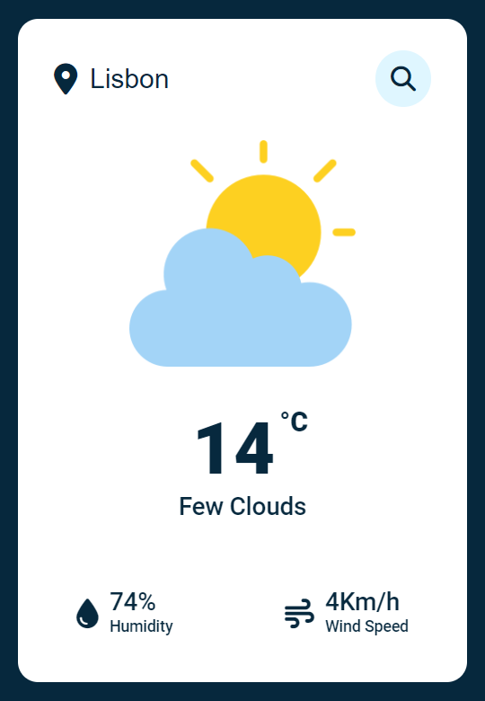

# WeatherApp by Leote

This is a Weather App developed in HTML/CSS and Javascript, using the [OpenWeatherMap](https://openweathermap.org/) free API.

## How to use it

You can download it directly from GitHub and run it from the index.html file in the browser or try it online through here [WeatherApp by Leote](https://leote-weatherapp.netlify.app/).

## Autors/Credit

- [@henriqueleote](https://www.github.com/henriqueleote)
